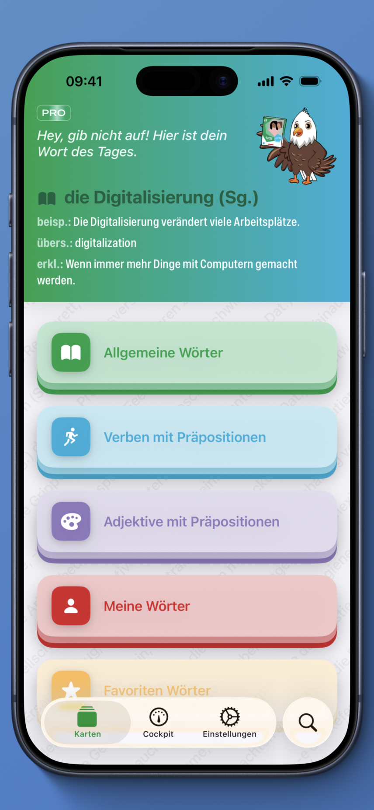
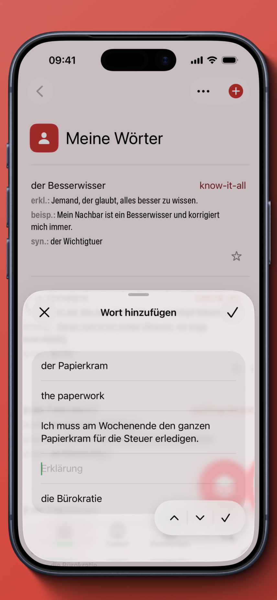
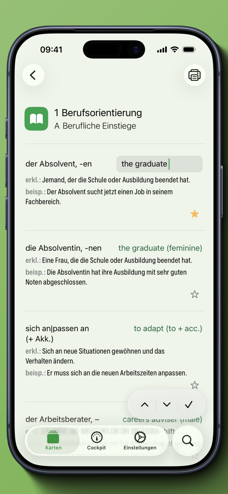
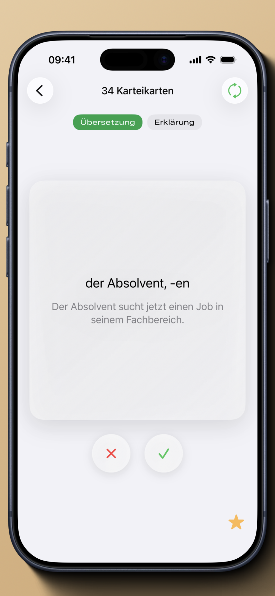

# Hero – Deutsch B2 Beruf

---

## Deutsch

Native **iOS-App** für **Berufsdeutsch auf B2-Niveau** — Vokabeln, Präpositionen und Lernkarten für den Berufssprachkurs.

Strukturierte Kapitel, Verben und Adjektive mit Präpositionen, eigene Wortlisten und ein Lern-Cockpit mit Fortschritt.

### Funktionen

- **Smart Learning** — Karteikarten mit **Spaced Repetition** (Übersetzung, Erklärung, Synonym)
- **Allgemeine Wörter** — 12 Lektionen / Kapitel (Berufsthemen)
- **Verben & Adjektive** — mit Präpositionen (eigene Listen pro Präposition)
- **Meine Wörter & Favoriten** — eigene Einträge, Gruppen, PDF-Export · optional **iCloud-Sync**
- **Cockpit** — Fortschritt, Wort des Tages, Lernstatistik
- **Mehrsprachig** — DE, EN · **Home-Screen-Widget** (Wort des Tages, Schnell hinzufügen)

### Technik

- **iOS 18+** · **Xcode** · **Swift** · **SwiftUI** · **WidgetKit**
- Strukturierter Code: **Views**, **Services**, **Components**, **Models** (~200 Swift-Dateien)
- **92 JSON**-Vokabeldateien; Kursinhalte versioniert im Repo
- **SwiftData** + **CloudKit (iCloud)** — Fortschritt, Favoriten, Spaced Repetition und eigene Wörter; optional auf **Apple-iCloud-Servern** synchronisiert (nicht nur lokal auf dem Gerät); Migration von Legacy-Daten; **datengetriebene** Auswertung pro Wort/Modus
- **Suchmaschine** über den gesamten Wortschatz (Kapitel, Verben, Adjektive, eigene Wörter)
- **Python** — `scripts/verify_localizations.py` (Key-Parität, ~290 Lokalisierungskeys, QA)
- **Lokalisierung** (DE, EN)
- **RevenueCat** / **App Store** — Abonnements
- **Firebase Hosting** — Landing Page · **Git** — eigenständiges Produkt (`develop`)

### Links

- [App Store](https://apps.apple.com/app/hero-deutsch-b2-beruf/id6755700752)
- [Website — App-Seite](https://www.gizatech.de/hero-b2-beruf)
- [Datenschutz](https://www.gizatech.de/hero-b2-beruf/privacy-policy)

Quellcode dieses Repositories; aktiv in Entwicklung (`develop`).

---

## English

Native **iOS** app for **professional German at B2 level** — vocabulary, prepositions, and flashcards for workplace German.

Structured chapters, verbs and adjectives with prepositions, custom word lists, and a learning cockpit with progress tracking.

### Features

- **Smart Learning** — flashcards with **spaced repetition** (translation, explanation, synonym)
- **General Words** — 12 lessons / chapters (job-related topics)
- **Verbs & Adjectives** — with prepositions (dedicated lists per preposition)
- **My Words & Favorites** — custom entries, groups, PDF export · optional **iCloud sync**
- **Cockpit** — progress, word of the day, learning statistics
- **Multilingual** — DE, EN · **home-screen widget** (word of the day, quick add)

### Tech

- **iOS 18+** · **Xcode** · **Swift** · **SwiftUI** · **WidgetKit**
- Structured code: **views**, **services**, **components**, **models** (~200 Swift files)
- **92 JSON** vocabulary files; course content versioned in the repo
- **SwiftData** + **CloudKit (iCloud)** — progress, favorites, spaced repetition, and custom words; optionally synced to **Apple’s iCloud servers** (not device-only); legacy data migration; **data-driven** per-word/mode analytics
- **Search engine** across the full vocabulary (chapters, verbs, adjectives, custom words)
- **Python** — `scripts/verify_localizations.py` (key parity, ~290 localization keys, QA)
- **Localization** (DE, EN)
- **RevenueCat** / **App Store** — subscriptions
- **Firebase Hosting** — landing page · **Git** — standalone product (`develop`)

### Links

- [App Store](https://apps.apple.com/app/hero-deutsch-b2-beruf/id6755700752)
- [Website — app page](https://www.gizatech.de/hero-b2-beruf)
- [Privacy policy](https://www.gizatech.de/hero-b2-beruf/privacy-policy)

Source code for this app; actively developed (`develop` branch).

---

## Screenshots

| Home | My Words |
|:---:|:---:|
|  |  |

| Words list | Flashcards |
|:---:|:---:|
|  |  |

---

## Author / Autor

Ildar Gizatullin
